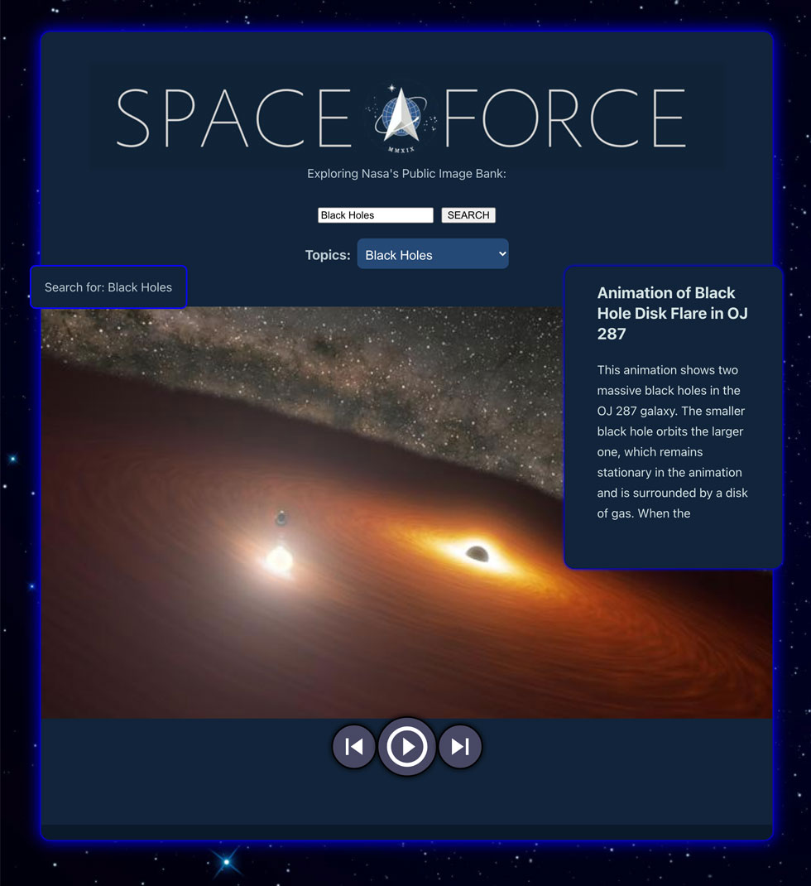

# SpaceForce2
Learn about science in a fun and interactive way by searching the Nasa public image bank for cool images.
Originally written with JQuery and vanilla Javascript, I refactored it with React and Redux to make for a more modern UI/UX.


# Table of contents
1. [Usage](#Usage)
2. [Live Demo](#Live_Demo)
3. [License](#License)
4. [Features](#Features)
5. [Technology](#Technology)
6. [Credits](#Credits)
7. [Badges](#Badges)
8. [User Story](#User_Story)
<a name="Usage"></a>
## Usage
```sh
npm start
```
<a name="Live_Demo"></a>
## Live Demo
https://enigmatic-anchorage-91060.herokuapp.com/
<a name='License'></a>
## License
[](https://lbesson.mit-license.org/)
<a name="Features"></a>
## Features
1. Cool images from Nasa
2. Interactive Carousel / slide show
3. Preset search topics
4. Ability to search by any term
<a name="Technology"></a>
## Technology
1. React
2. Redux
3. Nasa Image API
4. React Hooks / Custom Hooks

<a name="Credits"></a>
## Credits
Bart Dority
<a name="Badges"></a>
## Badges
 [](https://shields.io/)

**on github:** <a href='github.com/b0rgBart3'>b0rgBart3</a>

[](https://github.com/remarkablemark)

Email: borgBart3@gmail.com
<a name="User_Story"></a>
## User Story
```sh
As a student, I want to search the Nasa image bank for cool images, and learn about science topics.
```
